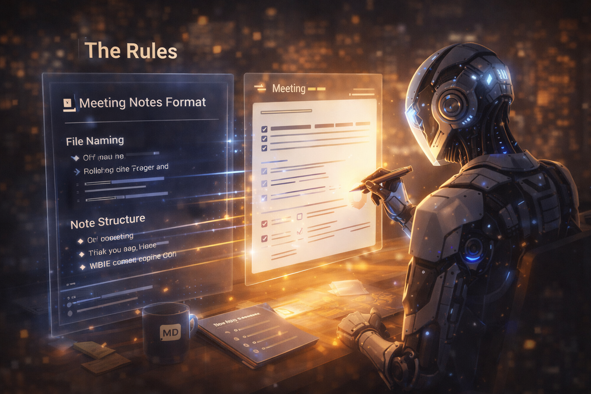
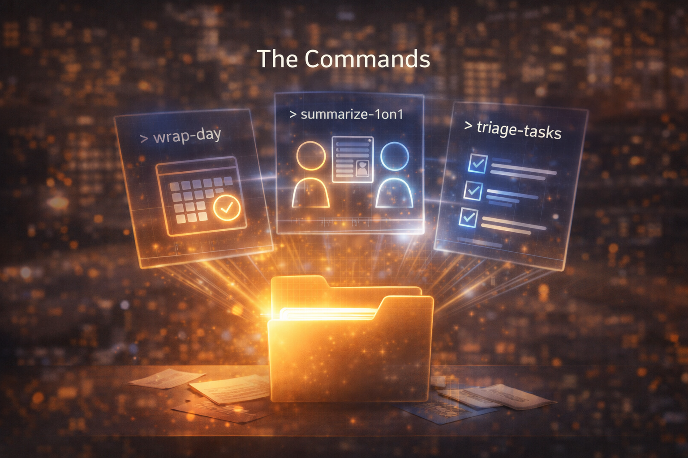
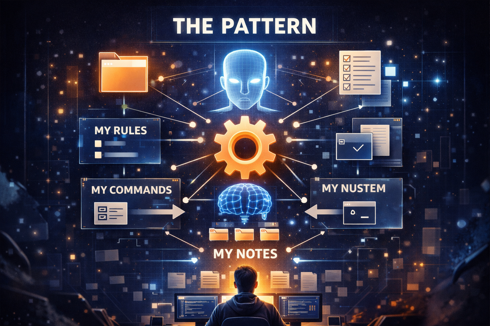

# My Notes Are Always Current. Not Because I'm Organized.


My notes are always current. Not because I'm organized — because an AI agent rebuilds the picture on command.

I started where most people start — Apple Notes, Notion, Bear, then Obsidian. Each one organized things its own way. Each one broke when my requirements changed. So I stopped using apps to manage my notes and started using an AI agent that reads and writes plain text files. When something isn't working, I edit a rule. The next time the agent runs, the system works differently. No migrations. No plugins. No waiting.

Every productivity app promises to organize your work. None of them let you rewrite the rules.

This article walks through how the system evolved — not as a grand design, but as an organic response to real frustrations. You'll see the structure, the automation, and the single insight that makes it all work.

---

## The Problem


Information goes stale the moment you write it down.

You sit down Monday morning. Somewhere in your notes are action items from last week's meetings. Some are done. Some were superseded. Some you forgot existed. You'd have to open five different notes and mentally reconstruct the state of the world. So you don't. You wing it.

You join a cross-team sync. Someone raises a topic. It sounds familiar. Was there a decision last time? Who was supposed to follow up? The notes exist somewhere, but finding the thread across three weeks of meetings would take longer than just discussing it again. So the same conversation happens for the third time.

You're about to meet with a direct report. What did you agree to last time? What topics have been simmering across multiple conversations? You scroll through past notes but they're just raw transcripts. No thread. No summary. No sense of what's still open.

These aren't organization problems. They're **freshness** problems. The information exists — it's just never synthesized, never rolled up, never kept current. And the tools you use can't help because they only store what you type. They don't process it. They don't summarize it. They don't track what changed since last time.

You could build templates, tag systems, database views. Obsidian and Notion both offer that. But the moment your needs change — a new meeting cadence, a different team structure, a realization that your action item format needs a source link — you're rebuilding templates and migrating data. Your requirements evolve weekly. Your tools update quarterly, if ever.

Every tool comes with opinions. Notion thinks in databases. Obsidian thinks in links and plugins. Apple Notes thinks in folders. When you adopt a tool, you adopt the author's mental model. You learn their vocabulary, their workflows, their limits. You become a prisoner of someone else's idea of how notes should work. And when that model doesn't fit your reality — you can file a feature request and wait.

If you don't need a mobile app — and for a work knowledge system, I don't — there's another path. Tools like Cursor work directly with plain markdown files. No proprietary format. No database schema. No plugin API to learn. Just text files in a folder, versioned with git, readable by any editor, and — critically — readable and writable by AI.

I needed a system where the information stayed fresh and the rules could change as fast as my thinking.

---

## The Moment It Clicked


I was already using Cursor as my AI agent environment. Not for writing code — I use JetBrains for that. Cursor is where I work *with* an AI agent: give it context, give it instructions, let it do the work. I'd been using it for code-adjacent tasks — generating configs, refactoring scripts, analyzing repos.

One day I opened my notes folder in Cursor instead of Obsidian. Not with a grand plan — I just wanted to quickly edit a meeting note. But Cursor didn't see "notes." It saw what it always sees: a directory of text files. And it did what it always does: offered to help.

I asked it to summarize last week's meetings. It read the files, found the meeting notes by date, and produced a coherent summary. Then I asked for open action items across all recent notes. It found them. Things I'd forgotten. Things buried in notes I hadn't reopened since writing them.

This wasn't a notes app with AI bolted on. This was an AI agent with direct access to my files — the same way it has direct access to source code. No API. No plugin. No intermediary. It could read everything, cross-reference anything, and write new files following whatever conventions I described.

That's when I made a deliberate choice: markdown files in a git repo. Not because markdown is trendy, but because it's the format AI agents work with best. Plain text. No binary blobs. No proprietary encoding. Version-controlled so nothing is ever lost. And cheap — every AI model reads text natively. No parsing, no conversion, no context window wasted on format overhead.

I didn't design a note-taking system. I gave an AI agent a folder and taught it how I think.

---

## The Folder


The first thing you need isn't AI — it's a structure the AI can navigate. But the structure has to be flexible enough to grow organically.

An AI agent reading your files is only as useful as the organization of those files. If everything lives in one flat folder, the agent wastes context window figuring out what's what. If the structure is too rigid, you spend more time filing notes than writing them. The sweet spot: **conventions, not constraints.**

I settled on a simple hierarchy. At the top: areas of work. Under each area: products, reference docs, and meetings. Meetings can live anywhere — under a product, under a team, at the root. The only rule: meeting notes go inside a `meetings/` folder, wherever that folder lives.

```
vault/
├── team-a/
│   ├── team.md
│   ├── product-x/
│   │   ├── product.md
│   │   └── meetings/
│   ├── product-y/
│   │   ├── product.md
│   │   └── meetings/
│   └── meetings/
│       ├── 1-on-1-alice/
│       ├── 1-on-1-bob/
│       └── weekly-sync/
├── initiatives/
├── people/
└── wraps/
```

The agent doesn't need a database. It uses `**/meetings/**/*.md` to find all meeting notes. It uses `*/product.md` to find all product areas. It reads `team.md` to understand the team structure. The folder tree *is* the schema — human-readable and machine-navigable.

Meeting notes are named `YYYY-MM-DD.md` for recurring meetings, `YYYY-MM-DD - Topic.md` for one-offs. That's it. No tags required to find them. No frontmatter. The date is in the filename, the context is in the folder path. The agent can glob for files by date range and know which meeting series they belong to from the directory name alone.

This structure isn't clever. It's deliberately boring. Boring is good — it means any AI model can understand it without elaborate instructions. The more predictable your file layout, the less you have to explain to the agent, and the less context window you burn on orientation.

I want to be clear: this is *my* structure. It doesn't have to be yours. That's the whole point. You don't need to adopt my mental model — you need to discover your own.

And here's the thing: describing your own structure is hard. It was hard for me. I knew how I wanted things organized — I could feel when a file was in the wrong place — but I couldn't write down the rules. So I asked the AI to help. I told it to look at my existing notes and describe the patterns it saw. Then I asked it to suggest improvements. It reflected my thinking back to me, cleaner than I could have articulated it myself.

The result is still how *I* think — the AI didn't impose a foreign structure. It helped me see my own structure clearly enough to write it down. And once it's written down, the AI can follow it, and I can change it anytime.

Start with whatever layout makes sense to you. The AI doesn't care. Describe your conventions in a rule, and the agent follows them. And when your conventions stop making sense — change the rule. No migration scripts. No restructuring by hand. The AI does the heavy lifting. The cost of being wrong is a text edit, not a weekend of moving files.

---

## The Rollup Machine


I had meeting notes. Dozens of them. Each one captured what happened on that day. But nobody reads old meeting notes. They sit there, decaying into irrelevance, while the same topics get re-discussed and the same action items get re-assigned because nobody remembers they already exist.

The system has two rollup mechanisms that solve this.

### Summary.md: The Living Thread

Every recurring meeting series gets a `Summary.md` file. Not a transcript. Not a log. A living document that the AI maintains by reading all the individual meeting notes in that folder and synthesizing them into one current picture.

A 1-on-1 `Summary.md` contains: the relationship context, hot topics that are currently active, open action items with source links back to the meeting where they were created, a topic history showing when things were first raised and how they evolved, and a ledger of which meetings have been summarized.

A weekly team sync `Summary.md` does the same for the group: recurring themes, decisions made, who owns what, what keeps coming back unresolved.

```markdown
# 1-on-1: Alice — Summary

## Hot Topics
- Cloud migration ownership — first raised 2026-01-15, still open
- On-call rotation concerns — resolved 2026-02-20

## Open Action Items
- [ ] Draft migration timeline @Alice 📅 2026-03-25
      ([2026-03-10](meetings/1-on-1-alice/2026-03-10.md))

## Summarized Meetings
- 2026-03-10 ✓
- 2026-03-03 ✓
- 2026-02-24 ✓
```

The `Summary.md` is the **canonical** location for open tasks in that meeting series. Not the individual notes. When the AI summarizes a new meeting, it merges — updates existing items, marks completed ones, adds new ones. One source of truth per meeting series. No duplication.

### Wraps: The Time Lens

The second mechanism operates on a different axis: time. Daily wraps pull from all meetings that day. Weekly wraps synthesize the dailies. Monthly wraps synthesize the weeklies. Quarterly wraps synthesize the monthlies.

```
wraps/
└── 2026/
    ├── Q1.md
    └── 03/
        ├── month.md
        └── W12/
            ├── week.md
            ├── 2026-03-16.md
            ├── 2026-03-17.md
            └── ...
```

Each level answers a different question. The daily wrap: "What needs my attention today?" The weekly: "What moved this week, and what's stuck?" The monthly: "What are the themes and trends?" The quarterly: "Where are we relative to goals?"

I don't write any of this. I run a command and the AI reads the source notes, follows the rules for what belongs in each wrap level, and generates the document. If I haven't run it in a few days, I run it and I'm caught up in seconds.

---

## The Rules



In Cursor, a rule is a markdown file that the AI reads before doing anything. It's not code. It's not config syntax. It's natural language describing how something should work. The AI reads it, understands it, and follows it every time it generates or modifies a file in your vault.

I write mine in English — not because I have to, but because as a developer I'm used to it. I'm not a native English speaker. You could write rules in Czech, Spanish, Japanese — the AI doesn't care. It understands intent in whatever language you think in. That alone makes this more accessible than any app with a fixed English UI and English documentation.

Here's a simplified version of a rule that defines how meeting notes should look:

```markdown
# Meeting Notes Format

## File Naming
- Recurring meetings: YYYY-MM-DD.md
- One-off meetings: YYYY-MM-DD - Topic.md
- All meeting notes live under **/meetings/ folders

## Note Structure
- H1: the date
- Meeting Summary: 3-5 key bullets
- Key Discussion Points: detailed topics as H3 subsections
- Action Items: checkbox format with owner and due date
- Follow-Up: items needing future attention

## Action Items
Use this format:
- [ ] Task description @Owner 📅 YYYY-MM-DD
```

That's it. The AI reads this and every meeting note it generates follows this structure. Every summary it builds knows to look for these headings. Every wrap knows where to find action items.

### The Power of Editing a Rule

Six months in, I realized my action items were missing something: I couldn't trace *where* an action item came from. Which meeting? What context? So I edited the rule. Added one line to the action item format:

```markdown
- [ ] Task description @Owner 📅 YYYY-MM-DD ([source](path/to/meeting.md))
```

That was a Tuesday afternoon. From that moment, every new meeting note, every summary, every wrap the AI generated included source links. No migration of old data. No plugin to install. No database column to add. I edited a text file and the system's behavior changed.

### Rules Compound

I started with one rule for meeting notes. Then I added one for the vault structure — so the AI knew where to put files. Then one for writing style — so generated content was concise, factual, and used consistent date formats. Then one for how action items should be reconciled across meetings.

Each rule is a small, focused file. They compose naturally. The AI reads all applicable rules before doing work, and the result is consistent output that follows all of your conventions simultaneously. It's like having a style guide that actually enforces itself.

In Notion, if you want to change how your meeting template works, you edit the template and then every *new* page follows it — but the old ones don't. In this system, the rule applies to everything the AI touches from now on, and if you ask it to regenerate old summaries, those update too. The rule is retroactive by nature.

---

## The Commands



Rules define *how* things should work. Commands define *what* to do. They're repeatable workflows you trigger on demand — the buttons of the system, except you can rewrite what any button does.

A command is a markdown file that describes a task for the AI to perform. "Read all meeting notes from this week. Extract action items. Generate a daily wrap at this path following the wrap rules." You run it, the AI executes it, and the output appears as a new file in your vault.

My system has a handful of commands that I run regularly:

- **wrap-day** — reads today's meeting notes, generates a daily wrap with summary, action items, and key points
- **wrap-week** — reads the daily wraps for the week, synthesizes them into a weekly view with themes, decisions, and carried-over tasks
- **wrap-month**, **wrap-quarter** — same pattern, higher altitude
- **summarize-1on1** — reads all unsummarized meeting notes in a 1-on-1 folder, updates the Summary.md with new topics, actions, and the summarized-meetings ledger
- **triage-tasks** — scans all Summary.md files for open action items and rebuilds a prioritized task list

A typical Monday morning: I run `wrap-day` for Friday if I didn't already. Run `wrap-week` for last week. Glance at the weekly wrap — thirty seconds and I know what moved, what's stuck, what I owe people. Before a 1-on-1, I run `summarize-1on1` for that person. The Summary.md updates. I read it. I know the open threads, the follow-ups, the history. Two minutes of preparation that would have taken fifteen minutes of scrolling through old notes.

Just like rules, commands are text files. When I realized my daily wraps were too verbose, I didn't open the command file and edit it manually. I told the AI: "Wraps are too long. Emphasize brevity, cut the filler, keep action items and key decisions only." The AI updated the command itself. When I wanted wraps to include a deadlines table, I described what I needed and the AI added it to the command.

I rarely edit rules or commands by hand. I describe what I want differently, and the AI modifies its own instructions. The system rewrites itself through conversation. The only thing I do manually is decide that something needs to change.

---

## The Bridge


One piece was still missing. Action items in my notes referenced Jira tickets, but Jira lived in a browser tab. I couldn't ask the AI "what's the status of this initiative?" because half the truth was in my vault and half was behind an API.

So I built a bash script that pulls Jira issues into markdown files — one file per issue, organized by status. But it doesn't just grab the title and status. It downloads the comments on the issue and fetches the related commits from GitHub. Each Jira issue becomes a self-contained story: what was requested, what was discussed, and what was actually built. All in one markdown file, sitting in the vault alongside meeting notes that reference the same work.

Now when the AI generates a wrap or triages tasks, it has the full picture. A meeting note mentions a Jira ticket — the AI can read the ticket's story, see the latest comments, check whether code was committed. It connects dots that would take a human twenty minutes of tab-switching to assemble. The vault becomes the single place where everything converges: meeting notes, summaries, tasks, Jira stories with their comments and commits. All in text. All readable by the agent.

This isn't limited to Jira. Any external system that can export data — calendars, emails, CRM records — can be mirrored the same way. Markdown is the universal adapter.

---

## The Pattern



Looking back, every piece of this system follows the same principle. The vault structure is described in a rule. The meeting format is described in a rule. The wrap generation is described in a command. The Jira sync is a script. Everything that defines how the system works is a text file I can read, edit, or ask the AI to rewrite.

In a traditional app, your requirements are embedded in the product's features. You can configure what the developer exposed. You can request what the product team prioritizes. You live within someone else's vision of how knowledge work should function. When your needs diverge from their roadmap, you build workarounds — or you switch tools and start over.

This system inverts that. The AI has no opinions about how your notes should work. It has no roadmap, no feature backlog, no design philosophy. It does what the rules say. You *are* the product team. Your rules *are* the product. And deploying a new version takes seconds — you edit a file and the next command run reflects the change.

None of this is novel if you're a developer. Plain text files. Git for version control. Rules as specifications. Commands as scripts. I applied the same principles I use for code to my knowledge base. Every note is versioned. Every change to a rule is a commit. Sensitive notes — like 1-on-1 meeting records — are encrypted before they're committed. If something breaks — if an AI-generated summary goes wrong or a rule change produces bad output — I `git diff` to see what changed, `git revert` to undo it. The same safety net that protects my code protects my thinking. There's no "undo" button that only goes back one step. There's full history, forever.

---

## Build Yours


You don't need to copy this system. You need to start one. The barrier is low: a folder, a few markdown files, an AI agent that can read them. Write your first rule — how your meeting notes should look. Write your first command — summarize this week's notes. See what comes out. Adjust. Iterate. The system will emerge from your own friction, just like mine did.

I've published a template repository with the folder scaffold, starter rules, and example commands. It's not my vault — it's a blank canvas with the machinery already wired. Fork it, delete what doesn't fit, add what does. Make it yours.

Your notes should work as hard as you do. Make the AI do the work.

**[Template Repository →](#)**
